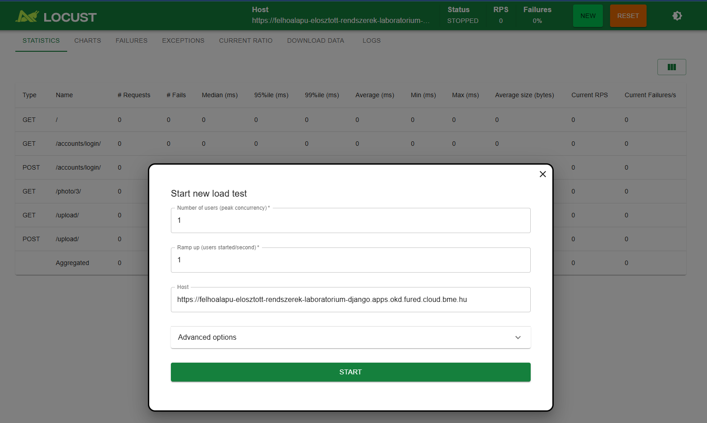
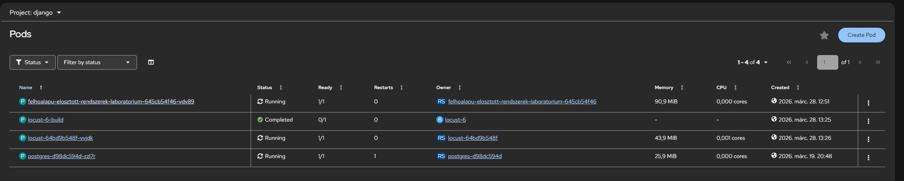
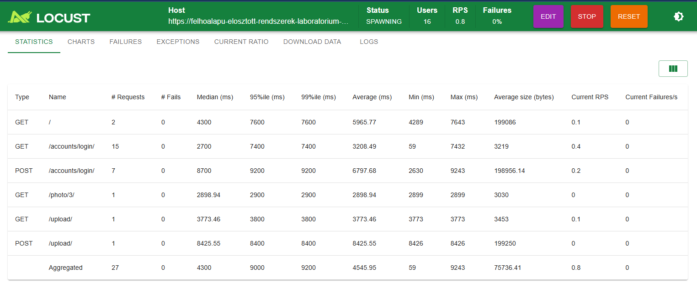
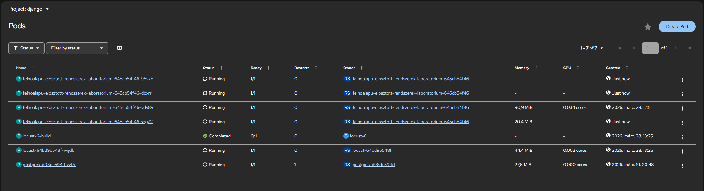
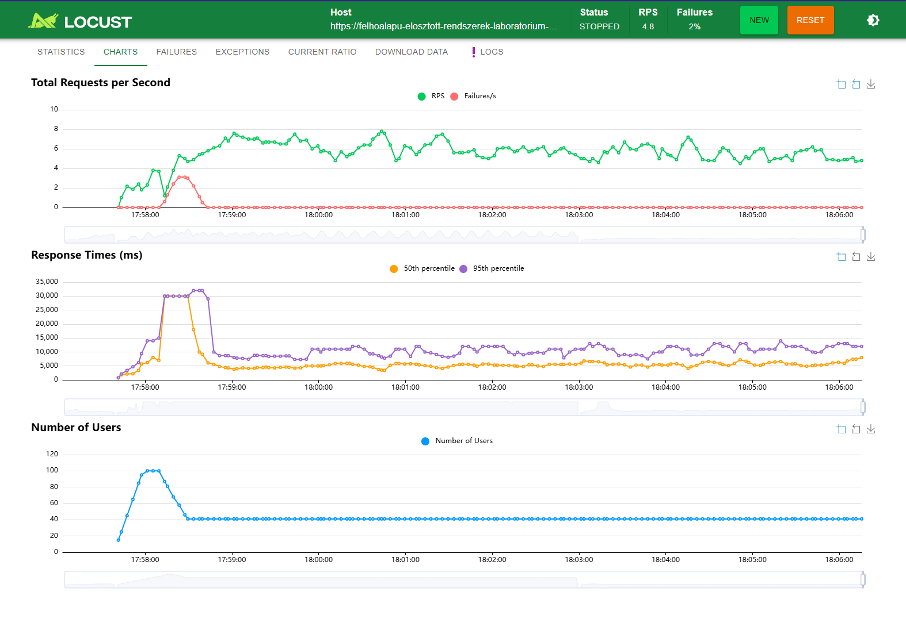
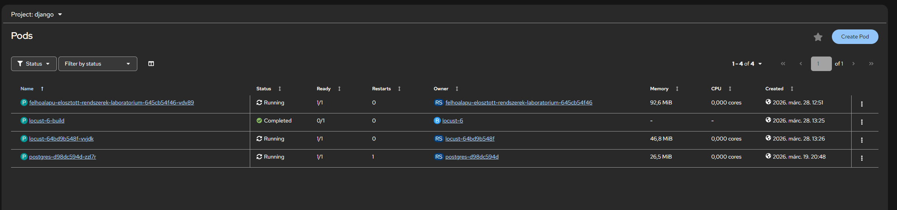

# Felhőalapú elosztott rendszerek laboratórium  
# Fényképalbum alkalmazás – 1. beadás

## Projekt célja

A feladat célja egy publikus PaaS környezetben futó, skálázható és többrétegű fényképalbum alkalmazás létrehozása.  

Az alkalmazás lehetővé teszi:

- Fényképek feltöltését és törlését
- Fényképek listázását név és dátum szerint rendezve
- Kép megjelenítését részletes nézetben
- Felhasználókezelést (regisztráció, bejelentkezés, kijelentkezés)
- Jogosultság alapú műveleteket (feltöltés/törlés csak bejelentkezett felhasználónak)

Az alkalmazás GitHubon érhető el, és publikus PaaS környezetben fut.

---

# Felhasznált technológiák

## Backend

- Python 3.12  
- Django 6  
- Gunicorn (WSGI alkalmazásszerver)  
- SQLite (1. beadás – konténeren belüli adatbázis)

A Django keretrendszer választásának indokai:

- Beépített autentikációs rendszer  
- ORM támogatás  
- Gyors fejlesztés  

---

## Frontend / UI

A felhasználói felület:

- Django template rendszerrel készült  
- HTML és alap CSS  
- Django beépített form kezelése  
- Egyszerű, letisztult, reszponzív elrendezés  

A főbb nézetek:

- Navigációs sáv (login / logout / regisztráció)
- Lista nézet rendezési lehetőséggel
- Részletes képnézet
- Feltöltési űrlap fájlfeltöltéssel


---

# PaaS környezet

Az alkalmazás az alábbi környezetben fut:

- OKD (OpenShift Kubernetes Distribution)

A rendszer:

- Konténerizált futtatás
- BuildConfig alapú build
- Deployment objektum
- Route alapú publikus elérés

---

# Konténerizálás

Dockerfile alapú build készült.

Főbb elemek:

- `python:3.12-slim` alap image
- `requirements.txt` telepítése
- Gunicorn indítás
- `entrypoint.sh` migrációk futtatására

Az entrypoint feladata:

1. Adatbázis migráció futtatása
2. Gunicorn indítása

---

# Adatbázis

## 1. beadás

- SQLite adatbázis
- `/tmp/db.sqlite3` helyen fut (OpenShift kompatibilis)

Ez a megoldás működőképes, de:

- Nem perzisztens pod újraindítás esetén
- Nem ideális horizontális skálázáshoz

A 2. beadásban külön adatbázis-szerver (pl. PostgreSQL) kerül bevezetésre.

---

# Fájlkezelés

A feltöltött képek:

- `MEDIA_ROOT` alatt kerülnek mentésre
- Írható könyvtárba konfigurálva OpenShift alatt

Jelenleg nem használ Persistent Volume-t, ezért:

- Pod újraindítás esetén a fájlok elveszhetnek

Ez a 2. beadás során kerül fejlesztésre.

---

# Biztonság

- Django beépített autentikáció
- CSRF védelem
- `CSRF_TRUSTED_ORIGINS` konfigurálva
- `ALLOWED_HOSTS` beállítva
- Jogosultság alapú feltöltés és törlés

---

# Build és deploy folyamat

Jelenlegi állapot:

- A repository publikus GitHubon
- OpenShift BuildConfig használatban
- Az alkalmazás manuális build után deployolható

Még nem teljesen megoldott (nem működik a webhook OKD-nál. 403-as hibát dob):

- GitHub webhook → automatikus build indítás push esetén

Ez a következő fejlesztési lépés része.

---

# Többrétegű architektúra

Az alkalmazás jelenlegi rétegei:

1. Web réteg – Django + Gunicorn  
2. Alkalmazás logika – Django ORM  
3. Adatbázis réteg – SQLite  

A 2. beadás célja:

- Külön adatbázis-szerver
- Perzisztens storage
- Teljes skálázható architektúra

---

# Skálázhatóság

OpenShift Deployment használatával:

- Több pod példány indítható
- Kubernetes load balancing biztosított
- Route biztosítja a külső elérést

SQLite használata miatt jelenleg a horizontális skálázás korlátozott, ezért a 2. beadás során külön adatbázis kerül bevezetésre.

---

# Funkcionális követelmények teljesülése

- Fénykép feltöltés  
- Fénykép törlés  
- Név (max. 40 karakter)  
- Feltöltési dátum mentése  
- Rendezés név szerint  
- Rendezés dátum szerint  
- Kép megjelenítése részletes nézetben  
- Felhasználó regisztráció  
- Bejelentkezés  
- Kijelentkezés  
- Jogosultság alapú műveletek  

---

# Következő fejlesztési lépések (2. beadás)

- Külső adatbázis-szerver
- Perzisztens fájltárolás (PVC)
- GitHub webhook automatikus build

---

# Összegzés

Az első beadás keretében elkészült:

- Egy működő, publikus PaaS környezetben futó fényképalbum alkalmazás
- Teljes felhasználókezelés
- Képfeltöltés és listázás
- Konténerizált deploy OpenShift környezetben

A második beadás során az architektúra továbbfejlesztése történik külön adatbázis-szerver és perzisztens tárolás bevezetésével.

<br>

# Fényképalbum alkalmazás – 2. beadás

# 2. beadás – Architektúra továbbfejlesztése

A második beadás során az alkalmazás architektúrája továbbfejlesztésre került annak érdekében, hogy megfeleljen egy skálázható, többrétegű felhőalapú webalkalmazás követelményeinek.

Az első beadásban alkalmazott konténeren belüli SQLite adatbázist egy külön PostgreSQL adatbázis-szerver váltotta fel, valamint bevezetésre került a perzisztens fájltárolás.

---

### Külső PostgreSQL adatbázis

Az alkalmazás adatbázis rétege külön Kubernetes Deployment objektumban futó PostgreSQL szerverre lett szétválasztva.

A PostgreSQL egy saját Service erőforráson keresztül érhető el a Django alkalmazás számára.  
A kapcsolat a Kubernetes belső DNS rendszerén keresztül történik az alábbi paraméterekkel:

- Host: `postgres`
- Port: `5432`
- Adatbázis neve: `album`

A Django alkalmazás konfigurációja PostgreSQL backend használatára lett módosítva, így az alkalmazás és az adatbázis külön konténerben, külön erőforrásként működik.

Ez a megoldás lehetővé teszi az alkalmazás réteg horizontális skálázását, valamint megfelel egy valós felhőalapú architektúra kialakításának.

---

### Perzisztens adatbázis tárolás

A PostgreSQL Deployment egy PersistentVolumeClaim erőforrást használ, amely a konténer adatkönyvtárához (`/var/lib/pgsql/data`) van csatolva.

Ennek eredményeként:

- az adatbázis tartalma pod újraindítás után is megmarad  
- deployment újragördítés esetén nem történik adatvesztés  
- az adatbázis állapottartó komponensként működik  

A PostgreSQL Deployment `Recreate` stratégiával lett konfigurálva annak érdekében, hogy új pod indítása előtt a régi pod leálljon, így a kötet biztonságosan újracsatolható legyen.

---

### Perzisztens média fájltárolás

A felhasználók által feltöltött képfájlok külön PersistentVolumeClaim segítségével kerülnek tárolásra.

Ez a kötet a Django alkalmazás Deployment-jében az alábbi útvonalra van csatolva: /app/media


A Django `MEDIA_ROOT` beállítása ehhez az útvonalhoz igazodik.

Ennek köszönhetően:

- a feltöltött képek nem vesznek el pod újraindítás esetén  
- az alkalmazás web rétege állapotmentessé válik  
- a fájltárolás elkülönül az alkalmazás logikától  

---

### Többrétegű architektúra

A rendszer a második beadás végére három fő rétegre bontható:

**Web réteg**
- Django alkalmazás
- Gunicorn alkalmazásszerver
- Kubernetes Deployment
- Route alapú publikus elérés

**Alkalmazás logika**
- Django ORM
- felhasználókezelés
- képfeltöltési és jogosultságkezelési funkciók

**Adat és tárolási réteg**
- PostgreSQL külön Deployment objektumban
- perzisztens adatbázis tárolás PVC segítségével
- perzisztens média fájltárolás külön PVC-n

Ez a felépítés megfelel egy klasszikus felhőalapú webalkalmazás rétegzett architektúrájának.

---

### Skálázhatóság és stabil működés

Az alkalmazás Kubernetes Deployment segítségével skálázható, így több Django pod is indítható.  
A Kubernetes Service biztosítja a terheléselosztást az alkalmazás példányai között.

A perzisztens kötetek használatának köszönhetően:

- a Django Deployment újraindítása nem okoz adatvesztést  
- a PostgreSQL Deployment újraindítása után az adatbázis tartalma megmarad  
- a feltöltött képfájlok perzisztensen tárolódnak  

A rendszer így stabilan működik pod újraindítás és deployment frissítés esetén is.

---

### Összegzés

A második beadás során az alkalmazás egy egyszerű konténerizált webalkalmazásból egy többrétegű, felhőalapú rendszer irányába fejlődött.

Megvalósult:

- külső PostgreSQL adatbázis használata  
- perzisztens adatbázis tárolás  
- perzisztens média fájltárolás  
- stabil működés deployment újraindítás esetén  
- skálázható alkalmazás architektúra  

<br>

# Fényképalbum alkalmazás – 3. beadás
## Skálázódó Webalkalmazás Dokumentáció

A feladat célja a fényképalbum alkalmazásszerverének automatikus skálázódásának bemutatása egy PaaS környezetben (OKD/OpenShift), valamint a skálázódás tesztelése terheléspróbával. Ehhez a Django alapú alkalmazást és a Locust terhelésgenerátort használtam.

---

## 2. Alkalmazás beállítása és skálázódás konfigurálása

1. **Django Deployment módosítása**
   - A konténer erőforrásait korlátoztam CPU és memória szempontjából, hogy a HPA kis terhelés esetén is indokolja a több pod elindítását.

2. **HPA (Horizontal Pod Autoscaler) létrehozása**
   - A Deployment-hez HPA-t konfiguráltam a minimum és maximum pod szám megadásával, valamint CPU-arány figyelésével.
   - A HPA-t az OKD webes felületén hoztam létre.
   - A beállított HPA biztosítja, hogy a CPU terhelés növekedése új podokat indít, és a terhelés csökkenésekor visszaskálázódik.

---

## 3. Terheléspróba elkészítése Locust-tal

1. **Locust testfile létrehozása**
   - A teszt lefedi a fényképalbum fő funkcióit: lista, részletezés, feltöltés.
   - Teszt felhasználót hoztam létre a Django appban `testuser`/`testpassword` névvel.
   - A szükséges tesztképet (`test.jpg`) is feltöltöttem a teszt konténerhez.

2. **Dockerfile a Locust számára**  
   - Létrehoztam egy Dockerfile-t, amely tartalmazza a Locust telepítését és a testfile-t.
   - Az image build és deployment OpenShift CLI segítségével történt:
     - `oc new-build` az új image létrehozására
     - `oc start-build` az image felépítésére
     - `oc apply -f <deployment>` a Locust Deployment létrehozására
     - `oc expose svc/locust` a webes felület eléréséhez

3. **Route létrehozása**  
   - Első próbálkozásnál a HTTPS miatt a Locust webes UI nem volt elérhető.
   - Hozzáadtam egy Route-ot a Locust szolgáltatáshoz, így a webes felület elérhetővé vált.

---

## 4. Locust Webes UI

- A webes felületen beállítható a felhasználók száma, a ramp-up idő és a futtatási idő.
- A teszt során például:
  - 10 felhasználó a csúcsban
  - Ramp-up: 1 user/sec
  - Host: a Django alkalmazás elérési címe
- Webes UI képernyőképe: 

---

## 5. Automatikus skálázódás dokumentálása

- A HPA monitorozása OpenShift CLI-vel (`oc get hpa`).
- Terhelés alatt az alkalmazás több podra skálázódott (pl. 1 -> 4 pod).
- Terhelés csökkenésével a podok visszaskálázódtak az eredeti számra (1 pod).
### Skálázódás:
- Terhelés előtt 1 pod fut: 
- Terhelés elindítása: 
- Terhelés közben 4 pod fut: 
- diagram a terhelésről: 
- Terhelés leállta után visszaáll 1 pod-ra: 
---

## 7. Tanulságok

- **Autoscaling működik**: a HPA sikeresen skálázta a podokat a terhelés növekedésére és csökkenésére.
- **Erőforrás-korlátok**: CPU/memória limit beállítás szükséges a kis terhelésű felskálázódáshoz.
- **Terheléspróba PaaS-on**: a Locust webes UI lehetővé tette a teszt konfigurálását felhőből.

---

<br>

# 4. beadás - Infrastructure-as-Code

### Használt eszköz

**Kustomize** – az OKD/Kubernetes beépített IaC eszköze. Nem igényel külön telepítést, az `oc` CLI-vel natívan támogatott. A telepítés egyetlen paranccsal elvégezhető:

```bash
oc apply -k k8s/
```

A `k8s/kustomization.yaml` összefogó fájl felsorolja az összes erőforrást, és automatikusan rárakja a `django-iac` namespace-t minden erőforrásra.

---

### Konfigurált komponensek

#### `imagestream.yaml`
Az OKD belső image registry-ben létrehoz egy tárolót (`ImageStream`) a Django alkalmazás Docker image-e számára. A BuildConfig ide tolja a kész image-et, a Deployment innen húzza le.

#### `buildconfig.yaml`
Megmondja az OKD-nek, hogyan kell az alkalmazást buildelni: a GitHub repóból letölti a forráskódot, és a `Dockerfile` alapján elkészíti a Docker image-et, majd az ImageStream-be tölti.

#### `postgres-pvc.yaml`
1 GiB perzisztens tároló (`PersistentVolumeClaim`) az adatbázis adatainak. `oc apply` nem törli, csak létrehozza ha még nem létezik – ez garantálja, hogy redeploy után az adatok megmaradnak.

#### `media-pvc.yaml`
1 GiB perzisztens tároló a felhasználók által feltöltött képeknek (`ReadWriteMany` módban, hogy több replika is elérhesse). Redeploy után a képek nem vesznek el.

#### `postgres-deployment.yaml`
A PostgreSQL adatbázis-szerver deployment konfigurációja. A `Recreate` stratégiát használja (egyszerre csak egy példány futhat), és a `postgres-pvc` kötethez csatlakozik.

#### `postgres-service.yaml`
Belső hálózati szolgáltatás, amely a `postgres:5432` címen teszi elérhetővé az adatbázist a klaszteren belül. A Django alkalmazás ezen keresztül csatlakozik.

#### `django-deployment.yaml`
A Django/Gunicorn alkalmazásszerver deployment konfigurációja. Az OKD belső registry-ből húzza le a buildelés eredményeként létrejött image-et, és a `media-pvc` kötetet `/app/media` alá csatolja. Erőforráskorlátok: 500m CPU, 1Gi memória.

#### `django-service.yaml`
Belső hálózati szolgáltatás a Django alkalmazáshoz a 8080-as porton.

#### `django-route.yaml`
Publikusan elérhető HTTPS végpontot hoz létre az alkalmazáshoz (`edge` TLS terminálással), amely a `django-service`-re irányítja a forgalmat.

---

### GitHub Actions workflow

A `.github/workflows/deploy.yml` fájl minden `main` ágra történő push esetén automatikusan lefuttatja a teljes deploy folyamatot.

**A lépések sorrendben:**

1. **Checkout** – letölti a repó aktuális állapotát
2. **oc CLI telepítése** – az `openshift-tools-installer` action telepíti az OpenShift parancssori eszközt
3. **Bejelentkezés az OKD-be** – a GitHub Secrets-ben tárolt szerver URL és token alapján (`OKD_SERVER`, `OKD_TOKEN`)
4. **IaC alkalmazása** – `oc apply -k k8s/` létrehozza vagy frissíti az összes erőforrást (PVC-ket nem törli)
5. **Postgres várakozás** – megvárja, hogy az adatbázis teljesen elinduljon, mielőtt a build elkezdődne
6. **Docker image build** – `oc start-build` elindítja az OKD-n a buildet a Dockerfile alapján, és megvárja a befejezést
7. **Rollout restart** – kényszeríti a Django deployment-et, hogy az új image-et töltse le
8. **Rollout várakozás** – megvárja, hogy az új pod teljesen elinduljon és healthy legyen

```
git push
    │
    v
oc apply -k k8s/        -> infrastruktúra létrehozása/frissítése
    │
    v
postgres ready?         -> megvárja az adatbázist
    │
    v
oc start-build          -> Dockerfile -> Docker image -> OKD registry
    │
    v
oc rollout restart      -> új pod indul az új image-gel
    │
    v
oc rollout status       -> sikeres deploy megerősítése
```

---

### Folyamatos frissíthetőség

Az `oc apply` parancs - szemben az `oc create`-tel - mindig csak frissíti a meglévő erőforrásokat, nem törli és hozza újra létre azokat. A `PersistentVolumeClaim` erőforrások különösen védve vannak: még ha a YAML-ból törölnénk is, az `oc apply` nem törli az adatokat tartalmazó köteteket. Ez garantálja, hogy az adatbázis tartalma és a feltöltött képek minden deploy után megmaradnak.